# 项目规划思考


## 项目背景

基于智能工坊和市场两部分内容进行推进。

目标：构建多Agent协作的智能内容生成平台。

## 商业化逻辑

参考：[商业化逻辑文档](https://kms.fineres.com/pages/viewpage.action?pageId=1390122946)

核心模块：模板、套件、智能工坊

收入模式：订阅制 + 按量付费（积分消耗，预留Agent差异化定价能力）

## 核心架构

### 系统分层

```
应用层：Gen-FVS Agent + 其他自研Agent（平行替代关系）
  ↓
服务层：Agent路由层（用户手动选择 + 系统推荐）
  ↓
业务层：积分引擎（预留差异化定价能力）
  ↓
基础层：产品基座权限 → 模板/套件权限
  ↓
底座层：底层框架迁移 + 用户/账户体系 + 数据模型
```


### 1. 底座层

**底层框架迁移**
- 目标：提供稳定的技术底座
- 关键产出：兼容层设计、性能基准

**用户/账户体系**
- 角色：超级管理员/企业管理员/普通用户/访客
- 组织：个人/企业/团队
- 认证：账号密码 + SSO + 第三方登录

**数据模型**
- 模板元数据（分类/版本/状态）
- 套件组合关系
- 积分账户（总积分/冻结/可用/流水）
- **Agent元数据（新增：能力描述/定价系数）**

### 2. 基础层

**产品基座权限**
- 权限模型：RBAC + ABAC混合
- 资源类型：页面/API/数据
- 操作类型：查看/编辑/删除/执行

**模板与套件权限**
- 模板可见性：公开/企业/私有
- 编辑权限：所有者/协作者
- 使用权限：免费/付费/订阅
- 套件权限继承与覆盖机制

### 3. 业务层

**积分引擎**
- 获取：行为奖励/任务完成/直接购买
- 消耗：Agent使用/模板下载（**预留：不同Agent可差异化定价**）
- 账户：总积分/冻结积分/可用积分/过期策略
- 流水：完整审计记录

### 4. 服务层

**Agent路由层（新增）**
- **用户选择**：手动切换不同Agent
- **系统推荐**：基于场景智能推荐
- **统一接口**：所有自研Agent实现相同协议
- **上下文管理**：跨Agent会话状态（暂不实现，预留接口）

### 5. 应用层

#### Q1 规划（当前阶段）

**核心Agent**：Gen-FVS Agent

**主要工作**：
1. 完成底座层和基础层建设
2. 积分规则引擎开发（支持差异化定价预留）
3. Gen-FVS Agent 正式发布
4. 商业化定价策略落地

#### Q2 规划

**多Agent引入**：
- 按统一标准接入其他自研Agent
- 与Gen-FVS形成平行替代关系
- 用户可手动选择或接受系统推荐

**功能增强**：
- 多模态支持
- 灵活布局方案
- 数据分析对接



## 待办事项

### Phase 1: 底座层（Week 1-4，可并行）

**底层框架迁移**
- [ ] 新旧框架差异评估
- [ ] 迁移方案制定（渐进式）
- [ ] 兼容层设计
- [ ] 核心组件迁移
- [ ] 性能基准测试

**用户/账户体系**
- [ ] 角色体系设计
- [ ] 组织架构设计
- [ ] 认证方式实现
- [ ] 会话管理策略

**数据模型**
- [ ] 模板数据模型
- [ ] 套件数据模型
- [ ] 积分账户模型
- [ ] **Agent元数据模型**

### Phase 2: 核心层（Week 5-10，部分串行）

**产品基座权限（Week 5-6）**
- [ ] 权限模型实现
- [ ] 资源与操作定义
- [ ] 权限校验中间件
- [ ] 权限缓存策略

**模板/套件权限（Week 7-8）**
- [ ] 可见性控制
- [ ] 编辑权限实现
- [ ] 使用权限（免费/付费）
- [ ] 版本权限管理

**积分引擎（Week 7-9，与权限并行）**
- [ ] 积分获取规则
- [ ] 积分消耗规则（**预留差异化接口**）
- [ ] 账户与流水管理
- [ ] 过期策略实现

**Agent路由层（Week 9-10）**
- [ ] 路由分发机制
- [ ] 用户选择界面
- [ ] 系统推荐策略（简单版）
- [ ] 统一Agent接口协议

### Phase 3: 商业化与发布（Week 11-14）

**商业化逻辑**
- [ ] 定价策略（订阅制 + 按量付费）
- [ ] 支付渠道接入
- [ ] 套餐与权益设计
- [ ] 发票/合同流程

**Gen-FVS Agent**
- [ ] 功能边界确认
- [ ] 性能优化
- [ ] 灰度发布
- [ ] 正式上线

### Q2 准备（持续进行）

**多Agent引入**
- [ ] 下一个Agent的需求分析
- [ ] Agent开发规范文档
- [ ] 接入流程验证

**功能增强**
- [ ] 多模态技术调研
- [ ] 灵活布局方案设计
- [ ] 数据分析对接方案


## 关联文档

- [[智能工坊]]
- [[市场]]

