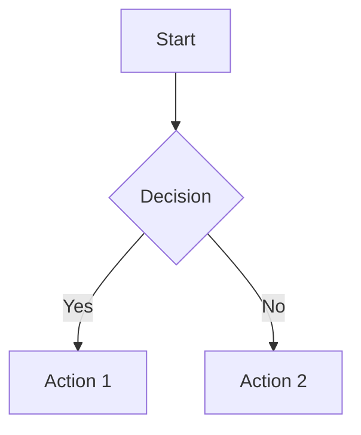
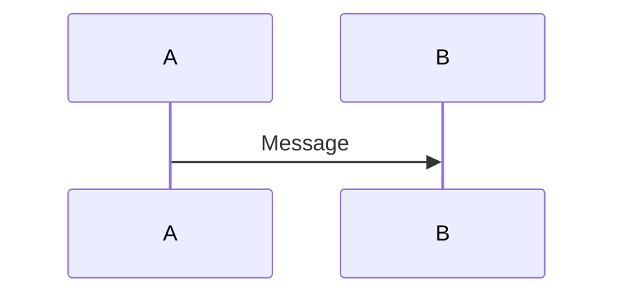
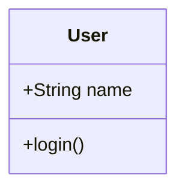

# Supported Markdown Syntax

This document describes all Markdown syntax supported by the Markdown to Confluence converter.

## Text Formatting

| Markdown | Result |
|----------|--------|
| `**bold**` | **bold** |
| `*italic*` | *italic* |
| `_italic_` | _italic_ |
| `` `code` `` | `code` |
| `~~strikethrough~~` | ~~strikethrough~~ |

## Headings

```markdown
# Heading 1
## Heading 2
### Heading 3
#### Heading 4
##### Heading 5
###### Heading 6
```

## Links

```markdown
[Link text](https://example.com)
[Relative link](./other-page.md)
```

## Images

### Standard Markdown
```markdown

```

### Obsidian Format
```markdown
![[image.png]]
```

### Base64 Images
```markdown

```

## Lists

### Unordered Lists
```markdown
- Item 1
- Item 2
  - Nested item
  - Another nested
- Item 3

* Alternative bullet
+ Another alternative
```

### Ordered Lists
```markdown
1. First item
2. Second item
   1. Nested ordered
   2. Another nested
3. Third item
```

### Task Lists
```markdown
- [ ] Unchecked task
- [x] Checked task
- [ ] Another todo
```

Converts to Confluence task list macro.

## Code

### Inline Code
```markdown
Use `functionName()` to call the function.
```

### Code Blocks
````markdown
```javascript
function hello() {
  console.log("Hello World");
}
```
````

Converts to Confluence code macro with syntax highlighting.

### Fenced Code with Language
````markdown
```typescript
const x: number = 42;
```

```python
def hello():
    return "world"
```

```bash
npm install
```
````

## Tables

```markdown
| Header 1 | Header 2 | Header 3 |
|----------|----------|----------|
| Cell 1   | Cell 2   | Cell 3   |
| Cell 4   | Cell 5   | Cell 6   |
```

Align columns with colons:

```markdown
| Left | Center | Right |
|:-----|:------:|------:|
| L    | C      | R     |
```

## Blockquotes

### Standard Note
```markdown
> This is a regular note blockquote.
> It can span multiple lines.
```

### Info Block
```markdown
> i This is an info message.
```

### Warning Block
```markdown
> ! This is a warning message.
```

### Tip Block
```markdown
> ? This is a tip message.
```

These convert to Confluence info, warning, tip, and note macros.

## Horizontal Rules

```markdown
---
***
___
```

## Front Matter

```markdown
---
title: Document Title
author: John Doe
date: 2024-01-01
---

# Content starts here
```

The title from front matter is extracted and used as the Confluence page title.

## Mermaid Diagrams

````markdown





````

Mermaid diagrams are rendered to PNG images and uploaded as attachments.

## Emoji Handling

Unicode emojis and shortcodes are automatically removed:

```markdown
# Input
Hello :smile: world 🎉

# Output
Hello world
```

## Obsidian-Specific Features

### Wiki Links
```markdown
[[Another Page]]
[[Another Page|Display Text]]
```

Converts to bold text (pages are not linked in Confluence).

### Embedded Images
```markdown
![[image.png]]
```

## Limitations

### Not Supported
- HTML in Markdown
- Footnotes
- Definition lists
- Math/TeX (use images instead)
- Checkboxes in regular lists (only task lists)

### Confluence Limitations
- No native support for:
  - Collapsible sections (details/summary)
  - Definition lists
  - Footnotes
  - Math equations

## Best Practices

1. **Use H1 for title** - First H1 or front matter title becomes page title
2. **Relative image paths** - Use relative paths for images to be uploaded
3. **Avoid deep nesting** - Confluence has limited list nesting support
4. **Check table widths** - Wide tables may need horizontal scrolling
5. **Use blockquote prefixes** - Prefix blockquotes with `!`, `?`, or `i` for special formatting
